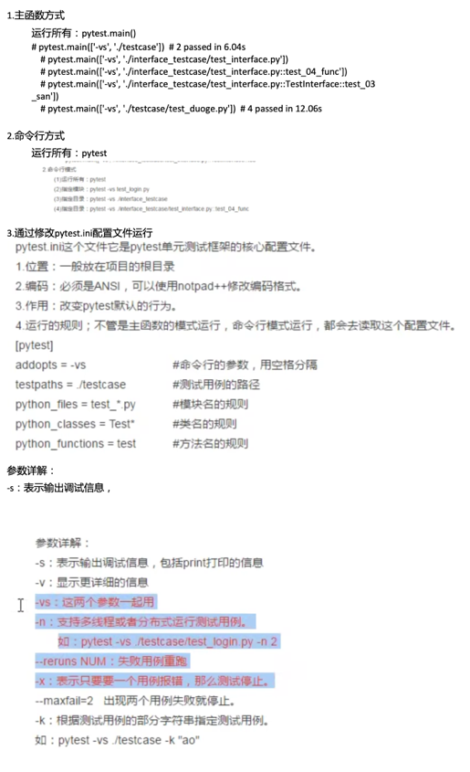

# pytest

## 一：pytest简介

1. pytest可以和Jenkins持续集成。
2. 可以实现测试用例的跳过以及reruns失败用例重试。
3. 可以和allure生成美观的测试报告。
4. 有很多强大的插件
   1. pytest
   2. pytest-html  生成html格式的自动化测试报告
   3. pytest-xdist  多CPU分发
   4. pytest-ordering  改变测试用例执行顺序
   5. pytest-rerunfailures  用例失败后重跑
   6. allure-pytest  用于生成测试报告
- 镜像：
- pip install -i https://pypi.tuna.tsinghua.edu.cn/simple
## 二：使用
1. 模块名必须以test_开头或者_test结尾
2. 测试类必须以Test开头，并且不能有init方法
3. 测试方法必须以test开头

## 三：运行方式


## 四：执行顺序
pytest默认从上到下执行

改变默认的执行顺序：使用mark标记
```
@pytest.mark.run(order=3)
```

## 五：如何分组执行
在配置文件里（pytest.ini）写好：smoke:冒烟用例

```
@pytest.mark.smoke
```
```commandline
pytest -m "smoke"
```

## 六：跳过测试用例
```
无条件跳过
@pytest.mark.skip(reason='没理由')
有条件跳过
@pytest.mark.skipif(age>=18, reason='已成年')
```

## 七：多线程和重跑
```commandline
多线程
 pytest ./testcase/test_resuns_n.py -n 2
重跑
 pytest ./testcase/test_resuns_n.py --reruns 2
```

## 八：pytest实现前后置（固件，夹具）
### 1：为什么需要这些功能
```python
 # 在所有用例之前只执行一次
 def setup_class(self):
     print('\n在每个类执行前的准备工作：比如：创建日志对象，创建数据库的连接，创建接口的请求对象')

 # 在每个用例之前执行一次
 def setup(self):
     print('\n执行用例之前初始化代码:打开浏览器，加载网页')
     
 def teardown(self):
     # time.sleep(3)
     print('\n执行用例之后的扫尾工作：关闭浏览器')

 def teardown_class(self):
     print('在每个类执行后的扫尾工作：比如：销毁日志对象，销毁数据库的连接，销毁接口的请求对象')

```
test_前后置.py
```commandline
pytest ./testcase/test_前后置.py -m 'smoke'
```

### 2:使用@pytest.fixture装饰器来实现<font color=green>部分</font>用例的前后置
- yield：分割前后置，也可以传参：yield request.param
- scope(范围):``"function"`` (default), ``"class"``, ``"module"``, ``"package"`` or ``"session"``.
- autouse(自动使用)：默认True，自动使用
- param(参数化):params=['张三', '王二', '麻子']，这里params是参数名，有s，request.param是没有's'的
- ids：当使用了params参数化时，给每一个值设置一个变量名，意义不大
- names：给表示的是被@pytest.fixture标记的方法取一个别名。

详情见：test_fixture.py
```commandline
 pytest ./testcase/test_fixture.py
```

### 3:通过conftest.py和@pytest.fixture()结合使用实现<font color=green>全局</font>的前后置应用
1. conftest.py文件是单独存放的一个夹具配置文件，名称是不能更改。
2. 用处可以在不同的py文件中使用同一个fixture函数。
3. 原则上conftest.py需要和运行的用例放到统一层。并且不需要做任何的import导入的操作。

### 4：断言
assert
```python
assert 1==2
```

## 九：pytest结合allure-pytest插件生成allure测试报告
1. 下载allure
   - mac：brew install allure
2. 安装allure-pytest
3. 生成json格式的报告
   - pytest.ini文件中：
```
addopts = -vs --alluredir ./temp
```
4. 生成allure报告
   - os.system('allure generate ./temp -o ./report --clean')
   - allure generate  命令，固定的
   - ./temp           临时的json格式报告的路径
   - -o               输出output
   - ./report         生成的allure报告的路径
   - --clean          清空./report路径下原来的报告
5. 运行all_test.py
6. 运行前可<font color=green>删除temp</font>临时文件，以防报告中含有其他用例结果。

## 十：参数化、YAML介绍
### 参数化
```
testcase/test_parametrize.py
```
@pytest.mark.parametrize()基本用法

@pytest.mark.parametrize(args_name, args_value)

args_name：参数名，用于将参数值传递给函数/方法

args_value：参数值（列表、元组、字典列表、字典元组）有多少值用例就会执行多少次。当参数值为字典等其他非字符串类型时，需要转换成字符串类型。


### YAML
```
testcase_yaml/yaml_util.py
get_token.yaml
```
大家应该记得，`fixture`有一个`params`参数，可以进行用例传参，但是`fixture`更倾向于前后置操作，而`yaml`更多用于实现参数化。

`yaml`是一种数据格式，扩展名可以是.yaml，.yml，支持#注释，通过空白字符缩进表示层级，且区分大小写。
**不能用`tab`键缩进**

用途：

1. 做配置文件；
2. 编写自动化测试用例

数据组成

1. 字典，即Key-Value键值对【注意冒号后面要加空格】 
2. 列表，使用-表示

使用前确认你已经安装了<font color=green>PyYAML</font>库


